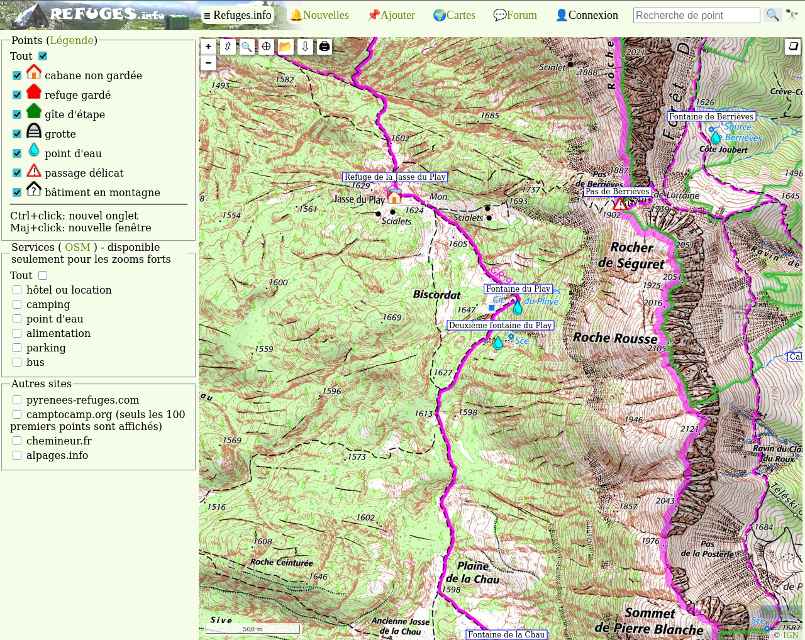

# Refuge Navigator

🚧🚧🚧

The purpose of Refuge Navigator is to:

- work on my first Go project
- fetch data from the awesome website [www.refuges.info](https://www.refuges.info/) and export them as GPX so that I can bring them offline when hiking.
  

## Credits

Refuge Navigator uses data sourced from [www.refuges.info](http://www.refuges.info), licensed under [CC BY-SA 2.0](https://creativecommons.org/licenses/by-sa/2.0/).

- Content from Refuges.info is attributed to `©Les contributeurs de Refuges.info`
- Specific contributions such as comments and photos are attributed to their individual authors as specified on the site.

Thus, the data coming from the use of Refuge Navigator is also licensed under [CC BY-SA 2.0](https://creativecommons.org/licenses/by-sa/2.0/).
